# Helsinki City Bike App

## 🚲 Welcome to the Helsinki City Bike App! 🌇

This is the pre-assignment for Solita Dev Academy Finland 2023. The app displays data from journeys made with city bikes in the Helsinki Capital area. You can explore the journeys, stations, and various statistics related to the bike usage.
## [💻 LIVE FRONTEND DEMO](https://academy-frontend-2023.herokuapp.com/)
## [💾 LIVE BACKEND DEMO](https://academy-server-2023.herokuapp.com/)
❕ Plesae note that the apps are hosted on Heroku servers, so it might take some time wake them up. ❕

❕ Testing logic, documentation and tests themselves were completed after the project deadline. If they will not count towards application, please still [check them out](#-testing). ❕

&nbsp;
# Tech Stack
## Frontend
- [React](https://reactjs.org/)
- [React Router](https://reactrouter.com/)
- [Leaflet](https://leafletjs.com/)
- [CoreUI](https://coreui.io/)
- [Axios](https://axios-http.com/)

## Backend
- [Node.js](https://nodejs.org/en/)
- [Express](https://expressjs.com/)
- [MongoDB](https://www.mongodb.com/)
- [Passport](http://www.passportjs.org/)
- [Bcrypt](https://www.npmjs.com/package/bcrypt)
- [Dotenv](https://www.npmjs.com/package/dotenv)
- [Cors](https://www.npmjs.com/package/cors)
- [JSON Web Token](https://www.npmjs.com/package/jsonwebtoken)
- [Nodemon](https://www.npmjs.com/package/nodemon)
- [Fast-csv](https://www.npmjs.com/package/fast-csv)

## Database
- For live example - [MongoDB](https://www.mongodb.com/) hosted on [DigitalOcean](https://www.digitalocean.com/)


# Installation
## Prerequisites

- Lastest [Node.js](https://nodejs.org/en) installed (check and compare with "node --version" in cmd)
- Version of [Git](https://git-scm.com/download) is at least 2.38.0 (check and compare with "git --version" in cmd)
- [MongoDB server](https://www.mongodb.com/try/download/community) installed (install MongoDB Community Server Download)

## Installation Steps
⚙️ To run the app locally, follow these steps:

1. Clone the repository:

   ```shell
   git clone https://github.com/OxCone1/Dev-Academy.git
   ```
2. Navigate to the project directory:

   ```shell
   cd Dev-Academy
   ```
3. Install the dependencies (Windows):
   - Auto:

     ```shell
     cd ./install-dependencies.bat
     ```
     
   - Manual:
   
     ```shell
     cd server
     npm i
     ```
     ```shell
     cd ..
     cd frontend
     npm i
     ```
     ```shell
     cd ..
     cd testing
     npm i
     ```

4. Start the MongoDB server (only in case if is not running after installation):

    ```shell
    mkdir "C:\data\db"
    "C:\Program Files\MongoDB\Server\6.0\bin\mongod.exe" --quiet
    ```

5. Start the backend server:

    ```shell
    cd..
    cd server
    node server.js
    ```
    Do not interrupt first launch procedures and wait until you see "Startup completed" in console.

6. Start the frontend server:

    ```shell
    cd..
    cd frontend
    npm start
    ```
7. Set up .env file in server directory:

    - Create .env file in server directory
    - Copy and paste this code in .env file:
    
      ```shell
      DATABASE_URL=mongodb://127.0.0.1:27017
      JWTKEY=inserthereyoursecret
      ```
    - Replace "inserthereyoursecret" with your own secret key. You can generate it [here](https://passwordsgenerator.net/).
    - If you want to use your own MongoDB server, change DATABASE_URL to your server URL.

8. If you want to use live version of the server with fully validated data in database:
    - Change fetchURL in [frontend/src/fetchURL.js](/frontend/src/fetchURL.js) from "http://127.0.0.1:3002" to "https://academy-server-2023.herokuapp.com".

&nbsp;

⚠️ If you have encountered any errors, see [Troubleshooting](#troubleshooting) section. ⚠️
---
&nbsp;

# 💻Frontend
## Ideal viewport size is 1920x1080px (1920x961-929) (Full HD)

## 1. Map (Stations) ([Leaflet library](https://leafletjs.com/))

- The map displays the locations of the stations in the Helsinki Capital area. The stations are marked with a bike parking icon(Pic.1). When you click on a station, the station's name, address and dynamically fetched statistics for the station are displayed. The statistics include average distance of journeys started from the station, average distance of journeys ended at the station, top 5 stations where started from this station journeys ended, and top 5 stations where ended at this station journeys started(Pic.2).

- On the side of station page there is a list of all the stations with enabled search bar(Pic.3), so you can search for a specific station, enabled pagination and page item limit. Also, when station is clicked in that list, it will located on the map and statistics will be displayed.

| Pic.1 | Pic.2 | Pic.3 |
| :---: | :---: | :---: |
| 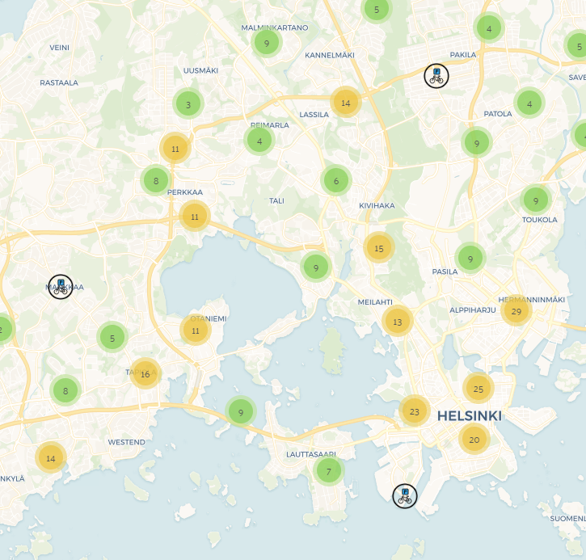 | 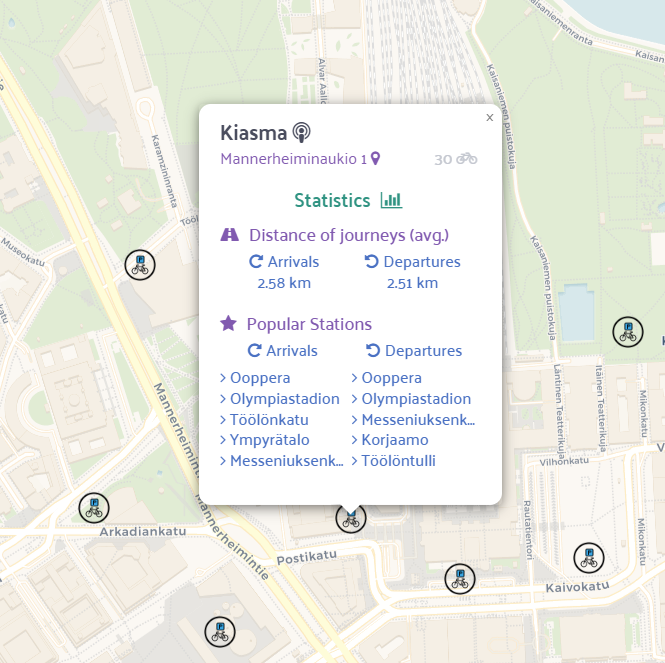 | 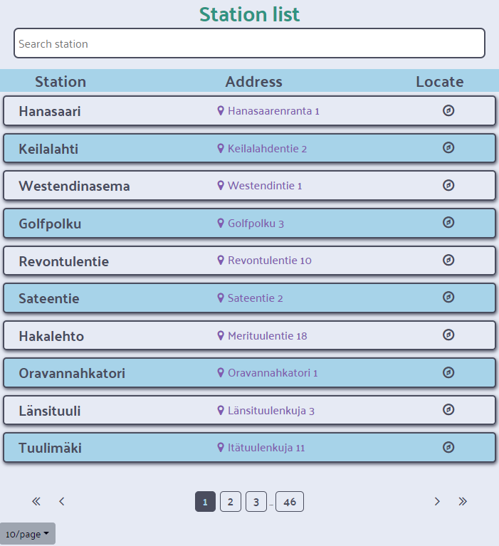 |


### 2. Map (Journeys) ([Leaflet library](https://leafletjs.com/))

- The journeys page displays a list of all the journeys made with city bikes in the Helsinki Capital area. Journeys contain the start and end times, duration, distance, and the stations where the journey started and ended(Pic.1). The list is paginated and the page item limit can be adjusted. The journeys can be sorted by the start and end times of the journey, the duration of the journey, and the distance of the journey in ascending or descending order(Pic.2). 

- When you click on a journey, it is displayed on the map with a line between the start and end stations(Pic.3).

| Pic.1 | Pic.2 | Pic.3 |
| :---: | :---: | :---: |
| 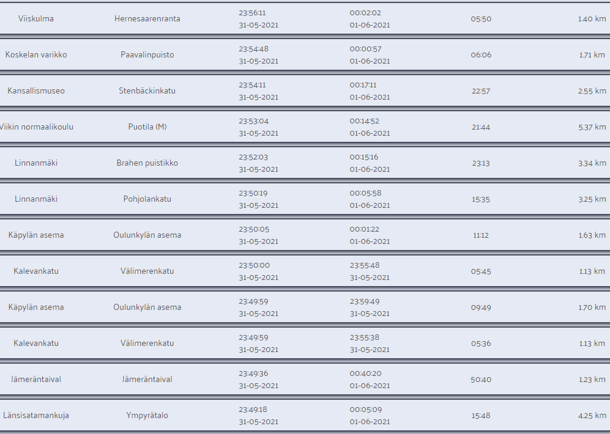 | 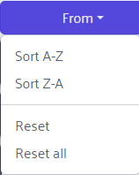 | 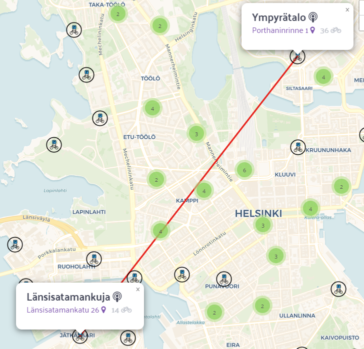 |

### 3. Adding Journeys/Stations

- This functionality is only available if user is logged in. But because there was no requirement to implement user registration, I have created a default user with username: "admin" and password: "admin". So, you can login with these credentials and add journeys and stations(Pic.1).

- The app allows you to add new journeys and stations to the database. The journeys and stations could be added by clicking on the "Add" button that will call a drop-down menu where you can choose to add a journey or a station(Pic.2). The journeys and stations are added to the database and displayed on the journeys and stations pages respectively.   

- When adding station or journey you will have to fill a form in shown modal(Pic.3). Input information carefully, as let's say, latitude and longitude are really sensitive to input. If you will input wrong latitude and longitude, station will still be added, but it might be located in the middle of nowhere.

| Pic.1 | Pic.2 | Pic.3 |
| :---: | :---: | :---: |
| 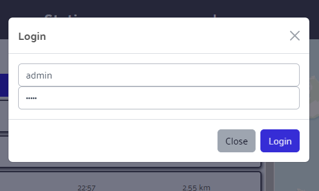 | 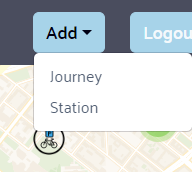 | 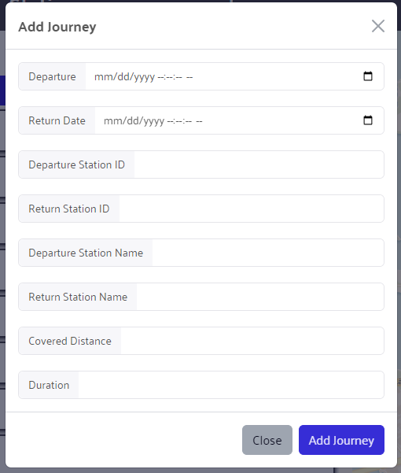 |

# 💾Backend

## API
&nbsp;

Base URL
--------

The base URL for all API endpoints is: `http://localhost:3002` or remote server `https://academy-server-2023.herokuapp.com/`


Authentication
--------------

Some endpoints require authentication using a JSON Web Token (JWT) in the request headers. You need to include the JWT in the Authorization header with the value `Bearer <token>`, where `<token>` is the JWT obtained after successful login.

Stations
--------

### Retrieve Stations

Retrieves a list of stations for pagination (+ search) or just list of all stations.

URL: `/map/stations`

Method: `GET`

Parameters:

-   `page` (optional): The page number for pagination. Default is 1. If provided, please also provide the `limit` parameter.
-   `limit` (optional): The maximum number of stations to retrieve per page. Default is 30. If provided, please also provide the `page` parameter.
-   `search` (optional): A search query to filter stations by name or address. The search is case-insensitive and matches partial words. If provided, please also provide the `page` and `limit` parameters.

Response (pagination):

-   `totalStations`: The total number of stations.
-   `currentPage`: The current page number.
-   `totalPages`: The total number of pages.
-   `hasNextPage`: Indicates whether there is a next page.
-   `hasPreviousPage`: Indicates whether there is a previous page.
-   `stations`: An array of station objects.

Response (list):

-   `stations`: An array of station objects.


### Get Station

Retrieves a specific station by its ID.

URL: `/map/getStation`

Method: `POST`

Request Body:

-   `ID`: The ID of the station to retrieve.

Response:

-   `station`: The station object.
-   `avgDistanceFrom`: The average distance from the station to other stations.
-   `avgDistanceTo`: The average distance to the station from other stations.
-   `topReturnStations`: The top return stations from the given station.
-   `topDepartureStations`: The top departure stations from the given station.

Journeys
--------

### Retrieve Journeys

Retrieves a list of journeys.

URL: `/map/journeys`

Method: `POST`

Request Body:

-   `options` (required): An object containing options for filtering and sorting journeys.
    -   `sort` (required): An object specifying sorting criteria for journeys. Provide at least an empty object `{}`.
        -  `field` (optional): The field to sort by. Possible values are `departure`, `returnDate`, `departure_station_id`, `departure_station_name`, `return_station_id`, `return_station_name`, `coveredDistance`, `duration`. If provided, please also provide the `order` parameter.
        -   `order` (optional): The sort order. Possible values are `-1` and `1`. If provided, please also provide the `field` parameter.
    -   `page` (optional): The page number for pagination. Default is 1. If provided, please also provide the `limit` parameter.
    -   `limit` (optional): The maximum number of journeys to retrieve per page. Default is 30. If provided, please also provide the `page` parameter.
    -   `filter` (optional): An object specifying filter conditions for journeys.

Response:

-   `totalJourneys`: The total number of journeys.
-   `currentPage`: The current page number.
-   `totalPages`: The total number of pages.
-   `hasNextPage`: Indicates whether there is a next page.
-   `hasPreviousPage`: Indicates whether there is a previous page.
-   `journeys`: An array of journey objects.

### Create Journey

Creates a new journey.

URL: `/map/journey`

Method: `POST`

Request Headers:

-   `Authorization`: JWT token for authentication.

Request Body:

-   `journey`: An object containing journey details.
    -   `departure`: The departure date of the journey (string).
    -   `returnDate`: The return date of the journey (string).
    -   `departure_station_id`: The ID of the departure station (number).
    -   `return_station_name`: The name of the return station (string).
    -   `return_station_id`: The ID of the return station (number).
    -   `departure_station_name`: The name of the departure station (string).
    -   `coveredDistance`: The distance covered during the journey (number).
    -   `duration`: The duration of the journey (number).

Response:

-   `message`: A success message indicating the journey creation status.

User Authentication
--------

### Login

Authenticates a user and returns a JWT.

URL: `/user/login`

Method: `POST`

Request Body:

-   `username`: The username of the user.
-   `password`: The password of the user.

Response:

-   `token`: The JWT token.

### Verify Token

Verifies a JWT.

URL: `/user/verify`

Method: `POST`

Authentication: Required (JWT)

Response:

-   Success: 200 OK (User verified)
-   Error: 401 Unauthorized or 500 Internal Server Error

&nbsp;

# 🔍 Testing
❕ Testing logic, documentation and tests themselves were completed after the project deadline. ❕

## Launching testing

1. If on the install of all dependencies for the project you have not installed the testing dependencies, run `npm i` in the testing folder.
2. You can start testing in 5 different ways (you have to be in the testing folder):
    - In case you want to only the tests (environment is ready - Node.js backend and React frontend are running):
        - `npm run start-all-manual` - will test both live and local frontend and backend
        - `npm run start-local-manual` - will test only local frontend and backend
    - In case you want to start the tests and the environment (Node.js backend and React frontend):
        - `npm run start-all-auto` - will launch local backend and frontend, and will test both live and local frontend and backend
        - `npm run start-local-auto` - will launch local backend and frontend, and will test only local frontend and backend
    - For testing only live frontend and backend, you don't need to start the environment, just run:
        - `npm run start-live`

3. After the tests are finished, you will see the results in the console.

## Testing with Puppeteer

The `webTester` function uses Puppeteer browser instance to simulate user interactions and validate the behavior of the web application. It performs actions such as clicking on elements, waiting for selectors, and navigating through different pages. The function returns `true` if all the tests pass, and `false` otherwise.

```javascript
const browser = await puppeteer.launch();
const url = "http://example.com";
await webTester(url, expectedTime);
```

Output will be:
```diff
In case of success:
+ Live/Local frontend passed checks and is functional

In case of failure:
- Live/Local frontend failed tests and is currently broken

Will also contain performance metrics for each run:
@@ Activation total time: MM m : SS.MS s for Live/Local frontend@@
@@ Percentage difference: ±% from expected time of SS seconds@@
```

## Testing with Axios

The `apiTester` function uses Axios to send HTTP requests to the backend and validate the behavior of the API. It performs actions such as sending requests, waiting for responses, and validating the response data. Output of `apiTester` is an Object containing the results of the tests - response status, response time and result of the test - `true` if the test passed, and `false` otherwise. The `apiTester` function tests all the endpoints of the API.

```javascript
const url = "http://example.com";
const response = await apiTester(url, expectedTime);
```

Output will be:
```diff
@@ url = "http://example.com" @@
In case of success:
+ testName : { status: 200/201, time: n, result: true }

In case of failure:
- testName : { status: 400/401/404/500/409/503, error: "error message", result: false }

Will also contain performance metrics for each run:
@@ Activation total time: MM m : SS.MS s for Live/Local frontend@@
@@ Percentage difference: ±% from expected time of SS seconds@@
``` 

### Performance Metrics

| Frontend Tests | Live Backend Tests | Local Backend Tests |
| :---: | :---: | :---: |
| 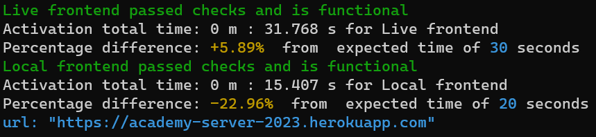 | 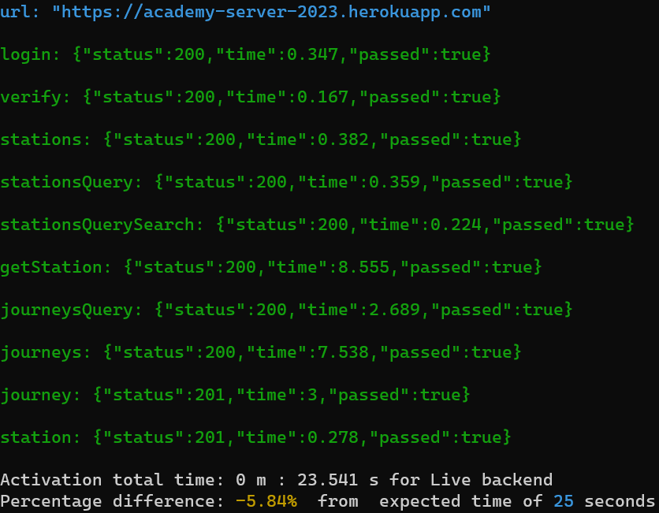 | 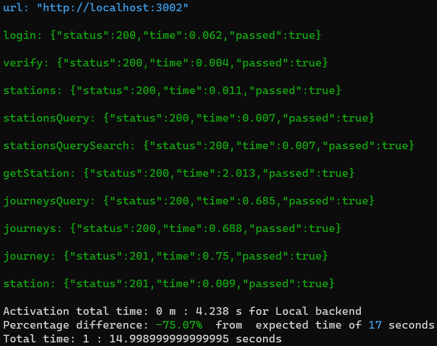 |

&nbsp;

# Troubleshooting
&nbsp;

## Server Startup Functions
---

The server contains startup functions that perform necessary operations for data initialization and validation.

### ❗ NOTE: The server will not start if you provide any launch arguments on startup. ❗ 

## Startup Initialization

The startup initialization function is called when the server starts. It performs the following operations:

### 1. Checks serverMemmoryData.json file for existing data on whether server has been initialized before.

- If file's `startUp` property is `true`, the server has not been initialized before and the function will continue to the next step.
    - It will then connect to the database and check if the database contains any data.
        - If the database contains data, the function will stop and return.
        - If the database does not contain data, it will start importing data from csv files.
    - After importing data from csv files, it will check and remove any duplicate in the database.
    - Then it will validate the data in the database. If the data is valid, it will set the `startUp` property in serverMemmoryData.json to `false` and return.
- If file's `startUp` property is `false`, the server has been initialized before and it will start the server with performing only validation operations.

### 2. Special startup arguments

- If you suspect that the data in the database contains duplicates, you can start the server with the `-clean` argument. This will remove all duplicates from the database. After removing duplicates, the server will stop. You can then start the server again without the `-clean` argument. 

    Example usage:

    ```bash
    node server.js -clean
    ```
- If you suspect that data have not been imported from csv files properly, you can start the server with the `-restore` argument. This will remove all data from the database and import data from csv files again. After importing data from csv files, the server will stop. You can then start the server again without the `-restore` argument. 

    Example usage:

    ```bash
    node server.js -restore
    ```

- If you want to have a fresh start, you can start the server with the `-kill` argument. This will remove all data from the database and reset the `startUp` property in serverMemmoryData.json to `true`. It will cause the server to perform all startup operation again (described in step 1). After resetting, the server will stop. You can then start the server again without the `-kill` argument. 

    Example usage:

    ```bash
    node server.js -kill
    ```
&nbsp;

## Known Issues
---

### 1. The server is running out of memory on CSV file import / duplicate removal / `-restore` argument
Even though multiple memory optimizations have been made, the server may still run out of memory on CSV file import, duplicate removal or `-restore` argument. This is due to the large amount of data being processed.
- ### Solution: 
    - Close all other applications that are using a lot of memory (Chrome, Steam, Discord, etc.)
    - Try restarting your computer and running the server again. This will free up memory.

### 2. In some cases MongoDB server has not started after it has been installed
- ### Solution:
    - See step 4 in [Installation steps](#installation-steps).
    - Try restarting your computer and running the server again. This will start the MongoDB server.
    - If the MongoDB server still does not start, try reinstalling MongoDB.
    - If the MongoDB server still does not start, try installing MongoDB server as a service. Instructions can be found [here](https://docs.mongodb.com/manual/tutorial/install-mongodb-on-windows/#run-mongodb-community-edition-from-the-command-interpreter).
    - If you see an error message with exit code 100, try resolving the issue by following the instructions [here](https://stackoverflow.com/questions/41420466/how-to-resolve-mongodb-failing-to-instantiate).

### 3. MongoDB server is running out of memory on heavy operations
In versions before 6.0.0, MongoDB server did not have an option to write smaller temporary files to disk (no `cursor.allowDiskUse()` function). This caused MongoDB server to run out of memory on heavy operations. This issue has been fixed in version 6.0.0.
- ### Solution:
    - Update MongoDB server to version 6.0.0 or newer.

### 4. Cloning the repository to folders/directories with special permissions required for writing/renaming/deleting files
If this happens, the server will not be able to change the `startUp` property in serverMemmoryData.json file. This will cause the server to perform fresh startup operations every time it starts (which includes importing data from csv files), thus resulting in a very long startup time.
- ### Solution:
    - Clone the repository to a folder/directory with no special permissions.

&nbsp;

# Personal Notes

I'm really proud of completing this project within the 7-day speedrun. It was quite challenging, but I managed to overcome the difficulties and implement all the required features.

During the development process, I faced a few obstacles. One of the major challenges was setting up the MongoDB server and ensuring its proper connection with the backend. At first, I had some issues with the MongoDB server not starting properly. Since then I was starting the server manually every time I wanted to run the app. (required me to put mongod as an environmental variable on my Windows machine). I also had to deal with the fact that Node.js server was running out of memory on heavy operations. I had to optimize the code a lot to reduce the memory usage. At one point, MongoDB and Node.js combined were using over 5.5GB of memory.

Implementing user authentication was another significant task. Although user registration was not required, I decided to create a default user with login credentials. This allowed me to secure the adding of journeys and stations to the database. I used JWT for authentication and integrated it into the backend API endpoints.

The frontend development involved working with React, React Router, and Leaflet libraries. I had to create interactive map components for displaying stations and journeys. It was a great learning experience to work with Leaflet and utilize its functionalities, such as markers and lines, to represent the data visually.

In terms of deployment, I hosted the frontend and backend on Heroku servers. It took some time to set up the deployment configurations correctly and ensure the smooth functioning of the apps on the Heroku platform.

Overall, this project allowed me to enhance my skills in full-stack development and gain experience in working with various technologies and libraries. I am satisfied with the final result and believe that I have successfully met the requirements of the Solita Dev Academy pre-assignment.

&nbsp;

# Contacts

- **Nickname: OxCone**
- [**Email**](mailto:v.lapins.cd@gmail.com)
- [**LinkedIn**](https://www.linkedin.com/in/vadims-lapins-75a6a3209/)
- **Discord: OxCone#1897**


# License

Journey data owned by [City Bike Finland](https://www.citybikefinland.fi/).

Station data file is owned by [HSL](https://public-transport-hslhrt.opendata.arcgis.com/datasets/helsingin-ja-espoon-kaupunkipy%C3%B6r%C3%A4asemat-avoin/explore).
